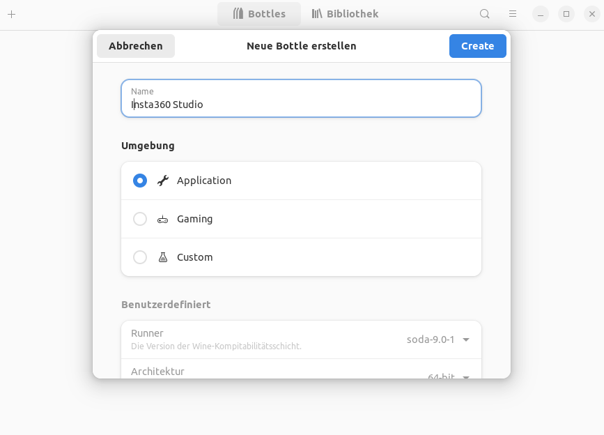
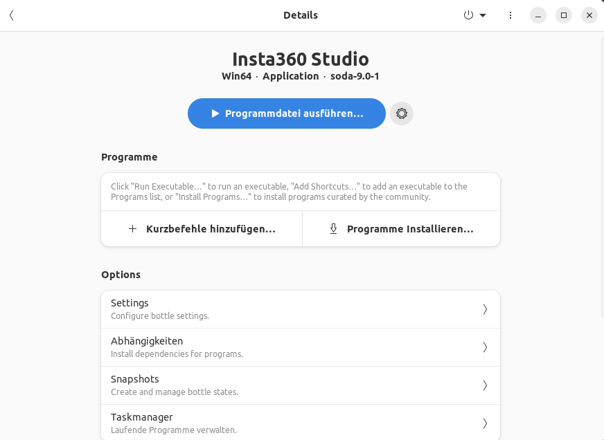
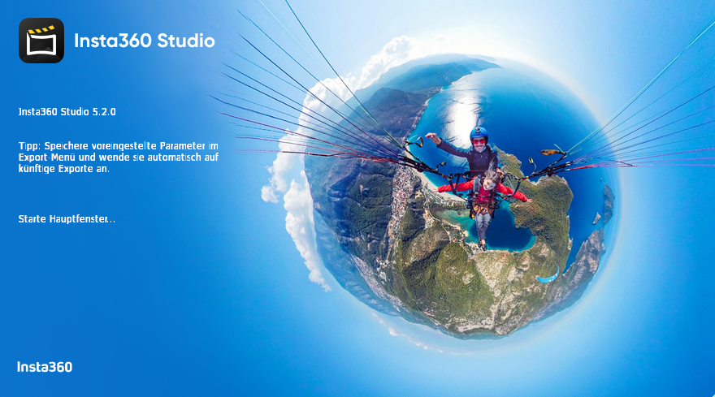
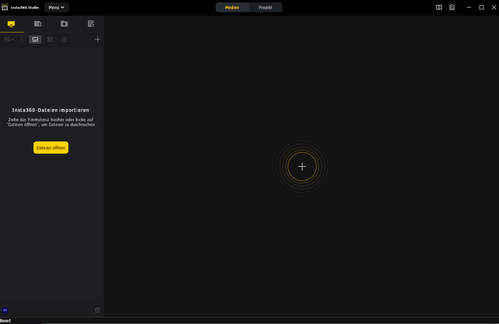

Insta360 Studio und Linux
=========================

Kurztest auf Ubuntu-20.04
-------------------------

```
sudo apt update
sudo apt install flatpak
sudo flatpak remote-add --if-not-exists flathub https://flathub.org/repo/flathub.flat
flatpak install flathub com.usebottles.bottles
  # Es wird SEHR viel herunterdeladen - unklar: Wohin?
  # Vollgelaufen sind /home und /var
  # /var/lib/flatpak -> /data/flatpak
sudo flatpak override --filesystem=host com.usebottles.bottles
flatpak run com.usebottles.bottles
  # UI erscheint
  # -> Durchklicken
```

Ausführliche Beschreibung
-------------------------

### [Insta360Studio 5.2.0](https://file.insta360.com/static/256bd8b05bfddf6db3326c37b8baa04d/Insta360Studio_5.2.0(RC_build30)_20240612_172647_1718184906680.exe) herunterladen

- Browser: [https://www.insta360.com/de/download](https://www.insta360.com/de/download)
- Insta360 STUDIO
  - Download for Windows - [2024-06-27](https://file.insta360.com/static/256bd8b05bfddf6db3326c37b8baa04d/Insta360Studio_5.2.0(RC_build30)_20240612_172647_1718184906680.exe) herunterladen)
- EXE-Datei speichern
- EXE-Datei auf Viren scannen

### Speicherbereich für Flatpak vorbereiten

Ich habe wenig Platz unterhalb von /var und
viel Platz unterhalb von /data, also:

```
sudo mkdir /data/flatpak
sudo ln -s /data/flatpak /var/lib/flatpak
```

### Bottles installieren

Kommandozeile in Linux:

```
sudo apt update
sudo apt install flatpak
sudo flatpak remote-add --if-not-exists flathub https://flathub.org/repo/flathub.flat
flatpak install flathub com.usebottles.bottles
  # Es wird SEHR viel heruntergeladen - mehrere GBs
sudo flatpak override --filesystem=host com.usebottles.bottles
flatpak run com.usebottles.bottles
  # UI erscheint
  # -> Durchklicken und beenden
```

### Bottle für Insta360 Studio erstellen

#### Bottles starten

```
~$ flatpak run com.usebottles.bottles
```

#### Neue Bottle für Insta360 Studio anlegen



#### Insta360 Studio in Bottle installieren



- Programmdatei ausführen anklicken
- Danach: Hertuntergeladene EXE-Datei von Insta360Studio 5.2.0 anwählen
- Durchklicken!

#### Insta360 Studio starten





Links
-----

- [Insta360 Studio Works In Linux ... AGAIN (April 2024, Video)](https://www.youtube.com/watch?v=i5U5AGn0apA)
- [Download Insta360Studio 5.2.0](https://file.insta360.com/static/256bd8b05bfddf6db3326c37b8baa04d/Insta360Studio_5.2.0(RC_build30)_20240612_172647_1718184906680.exe)

Historie
--------

- 2024-06-27 - Erste Version
